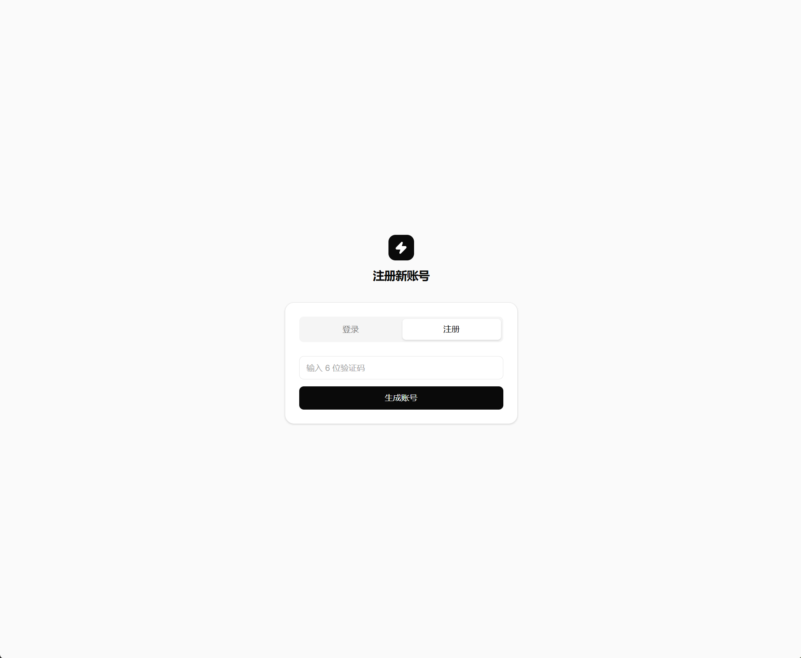
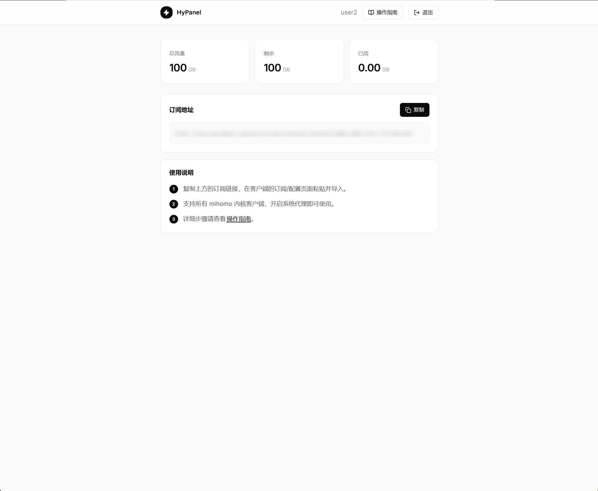
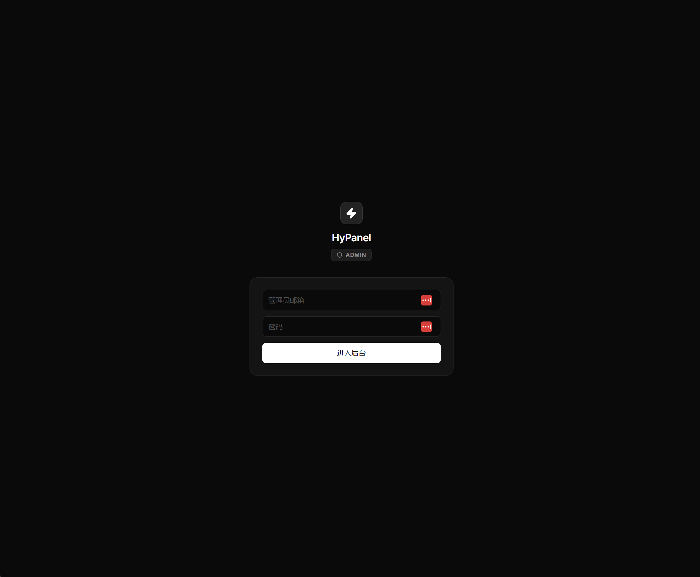
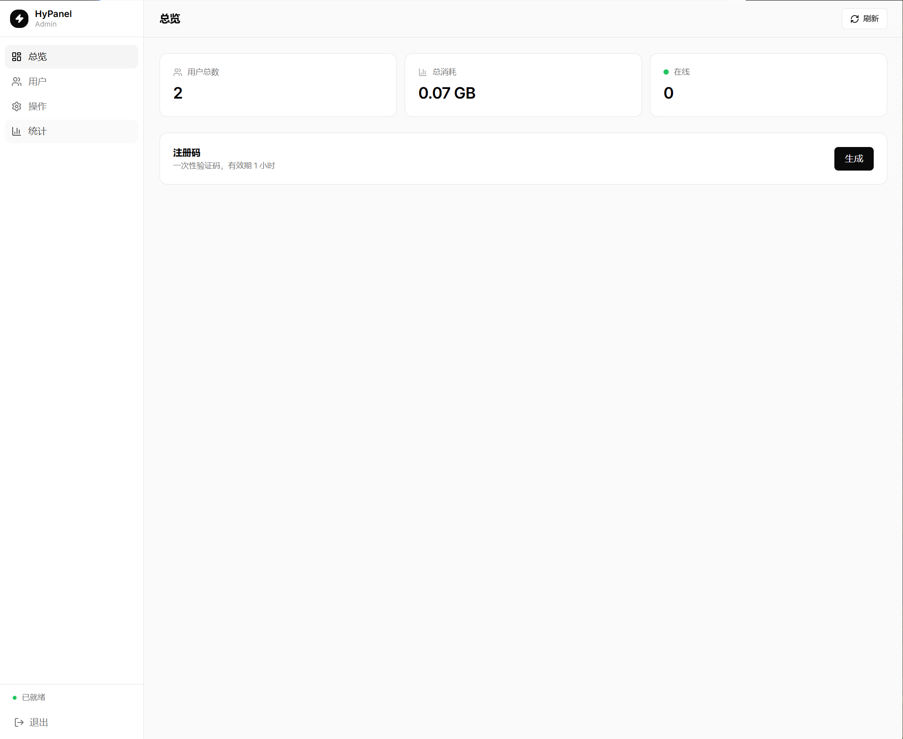

# HyPanel

简体中文 / [English](./README.en.md)

HyPanel 是一个面向 Hysteria2 的轻量自托管管理面板，包含用户端与管理员端。

## 功能概览

- 管理员登录、注册码生成、用户管理
- 用户注册码注册与登录
- 一键重置登录密码与代理密码
- 订阅链接下发（Clash 配置）
- 基于 Hysteria API 的流量与在线状态展示

## UI 预览

### 用户端




### 管理端




## 快速部署（Docker Compose）

1. 准备配置

```bash
cp .env.example .env
```

2. 编辑 `.env`（最少修改这些）

- `POSTGRES_PASSWORD`
- `JWT_SECRET`
- `ADMIN_BOOTSTRAP_EMAIL`
- `ADMIN_BOOTSTRAP_PASSWORD`
- `HYSTERIA_API_TOKEN`
- `HYSTERIA_SERVER`
- `HYSTERIA_SNI`
- `HYSTERIA_OBFS_PASSWORD`
- `SUBSCRIPTION_BASE_URL`（建议写完整 URL，例如 `https://your-domain.com/api/v1/subscriptions`）

3. 启动服务

```bash
docker compose --env-file .env -f deploy/docker-compose.yml up -d --build
```

4. 访问

- 前端：`http://<你的服务器IP>:3000`
- 后端健康检查：`http://<你的服务器IP>:8080/api/v1/health`

## 域名/反代说明（简版）

- 单域名：
  - `NEXT_PUBLIC_API_BASE_URL=/api/v1`
- 用户端/管理端分域名：
  - `NEXT_PUBLIC_USER_API_BASE_URL=https://user.example.com/api/v1`
  - `NEXT_PUBLIC_ADMIN_API_BASE_URL=https://admin.example.com/api/v1`

如未单独设置用户端/管理端变量，前端会回退到 `NEXT_PUBLIC_API_BASE_URL`。

## 常用命令

```bash
# 查看状态
docker compose --env-file .env -f deploy/docker-compose.yml ps

# 查看日志
docker compose --env-file .env -f deploy/docker-compose.yml logs -f

# 重启
docker compose --env-file .env -f deploy/docker-compose.yml restart

# 停止并删除容器/网络
docker compose --env-file .env -f deploy/docker-compose.yml down
```

## 开发目录

- `backend`：Go API
- `frontend`：Next.js
- `deploy`：Compose 编排文件

